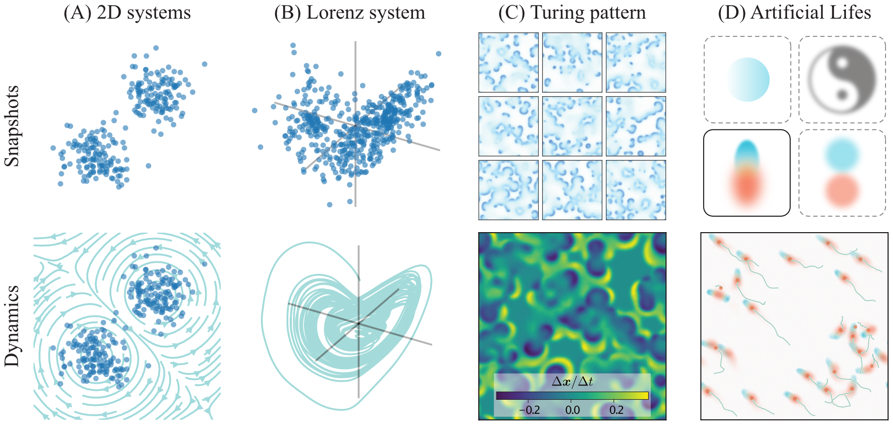

# *Equilibrium flow*: From Snapshots to Dynamics

How does snapshot distribution constrain the possible dynamics? When we see a pattern, how confidently can we say "This is the underlying dynamics" without seeing the time evolution? How does artificial life relate to real biological life? To answer these fundamental questions, we propose ***Equilibrium flow***: by learning the distribution-preserving dynamics, we can find possible dynamics to preserve the given data distribution without time information.



For **2D systems**, our method finds interesting non-trivial dynamics that preserve them.
For **Lorenz system**, a dynamical system with chaotic behavior, the recovered dynamics also exhibit chaotic behavior with positive Lyapunov exponents. For **Turing patterns**, we propose a training-free method, which has a limited solution space, but is much faster. The resulting dynamics are also highly aligned to the ground-truth.

Beyond these, we also explore the design capability with our method on **Artificial Life**. With given manually designed patterns, our method not only finds the dynamics / neural cellular automata that preserve the pattern, but also reveals collective behaviors.


https://github.com/user-attachments/assets/2a7d1bd9-c07e-44af-9610-0ceaf0aab761

> Background music generated with Sono AI.


# Quick Start

## Low-dimensional dynamical systems

### Step 1: Train diffusion model

Run the following command:

```bash
python train_diffusion.py --model lorenz [or two_peaks, ring, two_moons]
```

This will train a diffusion model on the Lorenz system. The trained model is saved in `./results/lorenz/diffusion_model.pth`.

### Step 2: Train dynamics model

Run:

```bash
python train_dynamics.py --model lorenz --num_experiments 1
# Use the same model as the diffusion model
# You can set num_experiments to the desired number of experiments if you want multiple results
```

The trained dynamics model is saved in `./results/lorenz/models/dynamics_models_<id>.pth`.

### Step 3: Load model

```python
import torch
from models import Flow, FlowKernel


model_id = 'lorenz'
score_model, dataset = load_model(model_id)

# Load trained dynamic model
v = FlowKernel(dim=dataset.dim)
v.load_state_dict(torch.load(f'./results/lorenz/models/dynamics_model_{model_id}.pth'))
```

This `v` model takes a `torch` tensor and return $v=dx/dt$.